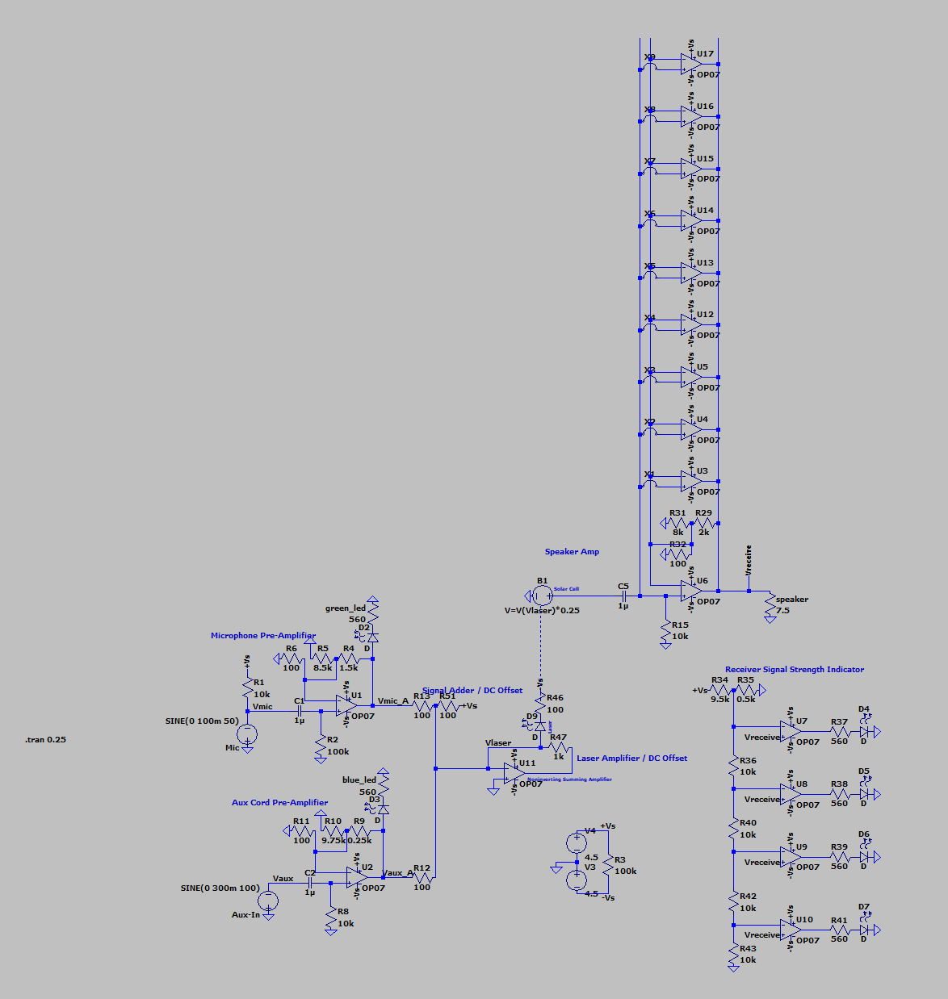

# Laser-Based Audio Transmission System

An LTspice circuit that combines microphone and auxiliary audio inputs, modulates the signal through a laser transmitter, and reconstructs it through a receiver and speaker amplifier.

## LTspice File

[Open the LTspice schematic](./Laser-Based%20Audio%20Transmission%20System.asc)
